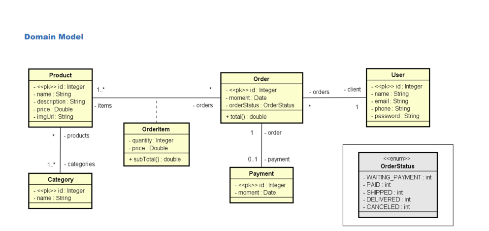
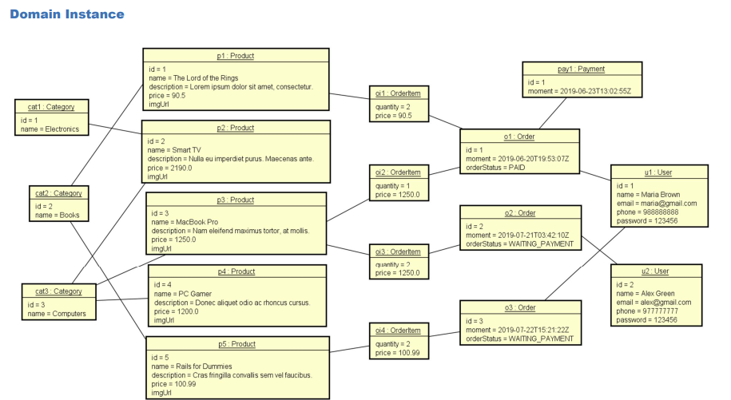

<h1>Projeto web services com Spring Boot e JPA / Hibernate </h1>
<h2>Projeto desenvolvido durante o progresso do Curso Java POO ministrado pelo Dr. Nelio Alves</h2>

Objetivos do projeto:

 Criar projeto Spring Boot Java

 Implementar modelo de domínio

 Estruturar camadas lógicas: resource, service, repository

 Configurar banco de dados de teste (H2)

 Povoar o banco de dados

 CRUD - Create, Retrieve, Update, Delete

 Tratamento de exceções 

<h2>Ferramentas utilizadas no desenvolvimento</h2>

- SpringBoot
- Maven
- Banco de Dados H2
- Postman 
- PostgreSQL
- Heroku

<h2>Modelo de domínio aplicado</h2>

Créditos: Dr Nélio Alves

<h2>Instância de domínio</h2>

Créditos: Dr Nélio Alves

Link da aplicação: https://desbravando-springboot.herokuapp.com/
---------------------------------

"Desafie seus limites!"
🚀🚀🚀